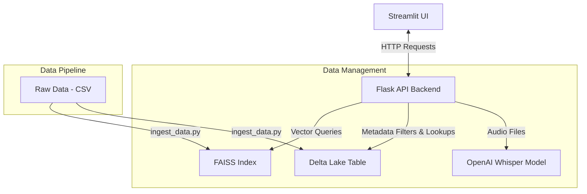

# 🌊 Lakehouse-Native Vector Search Engine

An end-to-end, high-performance, containerized vector search engine designed for lakehouse architectures. It combines the structured storage benefits of **Delta Lake** with the speed of **FAISS** vector search, and integrates **OpenAI's Whisper** model for speech-to-text transcription.

---

## 🏗️ Architecture Overview

The system architecture consists of a Docker-orchestrated setup containing a Streamlit frontend and a Flask backend. It integrates with Delta Lake for ACID-compliant structured metadata queries and FAISS for sub-millisecond similarity search.



---

## 🚀 Key Features

*   **Vector Search**: Generate dense vector embeddings from user queries using the `all-MiniLM-L6-v2` Sentence Transformer model and retrieve similar items using FAISS.
*   **Hybrid Search**: Combine structured SQL-like filtering on Delta Lake (e.g., category filtering) with dense vector indexing on FAISS for contextual search.
*   **Audio Transcription**: Upload audio files (`.wav`, `.mp3`, `.m4a`) to be transcribed in real-time using OpenAI's Whisper `base` model.
*   **Lakehouse Integration**: Metadata is stored locally using **Delta Lake**, enabling transactional safety, schema enforcement, and versioning.
*   **Containerized Environment**: Easy deployment with Docker and Docker Compose.

---

## 📁 Project Structure

```
.
├── Dockerfile.api            # Docker recipe for the Flask API Backend
├── Dockerfile.ui             # Docker recipe for the Streamlit UI Frontend
├── README.md                 # Project documentation
├── backend/
│   ├── app.py                # Flask application entrypoint & API routes
│   └── core/
│       └── search_service.py # Vector search, hybrid search, & Whisper logic
├── config.py                 # Central configurations & path constants
├── data/
│   ├── processed/            # Location of FAISS index & Delta Lake tables (git ignored)
│   └── raw/
│       └── sample_data.csv   # Raw dataset used for initial indexing
├── docker-compose.yml        # Multi-container orchestrator configuration
├── notebooks/
│   └── ingest_data.py        # Pipeline to embed text, generate FAISS index & Delta tables
├── requirements.txt          # Python dependencies
└── ui/
    └── dashboard.py          # Streamlit UI dashboard code
```

---

## 🛠️ Getting Started

You can run this project either locally or using Docker.

### Method 1: Using Docker Compose (Recommended)

Make sure you have [Docker](https://www.docker.com/) installed and running on your machine.

1.  **Build and start the containers**:
    ```bash
    docker-compose up --build
    ```
2.  **Open the dashboard**:
    Once the build completes and services start, navigate to `http://localhost:8501` in your browser to access the Streamlit UI.
3.  **API Access**:
    The Flask backend API is exposed at `http://localhost:5001`.

---

### Method 2: Local Setup (Without Docker)

1.  **Clone the repository**:
    ```bash
    git clone https://github.com/siddharthp-git/Lakehouse-Native-Vector-Search-Enginer.git
    cd Lakehouse-Native-Vector-Search-Enginer
    ```

2.  **Set up a virtual environment**:
    ```bash
    python3 -m venv venv
    source venv/bin/activate
    ```

3.  **Install dependencies**:
    Make sure you have `ffmpeg` installed on your machine (required for Whisper audio processing).
    *   *macOS (Homebrew)*: `brew install ffmpeg`
    *   *Ubuntu/Debian*: `sudo apt-get install ffmpeg`
    ```bash
    pip install -r requirements.txt
    ```

4.  **Run Ingestion & Build the Indices**:
    Ingest the sample raw data to generate the FAISS index and Delta Lake metadata:
    ```bash
    python notebooks/ingest_data.py
    ```

5.  **Run Backend (Flask API)**:
    ```bash
    python backend/app.py
    ```

6.  **Run Frontend (Streamlit Dashboard)**:
    In a new terminal (with the virtual environment activated):
    ```bash
    streamlit run ui/dashboard.py
    ```

---

## 🔌 API Documentation

### 1. Vector Search
Perform semantic vector search using a text query.
*   **Endpoint**: `/search`
*   **Method**: `GET`
*   **Query Parameters**:
    *   `q` (string): The search query text.
*   **Example Request**:
    ```bash
    curl "http://localhost:5001/search?q=photosynthesis"
    ```
*   **Response**:
    ```json
    [
      {
        "id": 2,
        "text": "Photosynthesis is the process used by plants.",
        "category": "science"
      }
    ]
    ```

### 2. Hybrid Search
Perform search matching vector embeddings combined with category filters.
*   **Endpoint**: `/hybrid-search`
*   **Method**: `GET`
*   **Query Parameters**:
    *   `q` (string): The search query text.
    *   `category` (string): Category filter (e.g., `science`, `finance`, `art`).
*   **Example Request**:
    ```bash
    curl "http://localhost:5001/hybrid-search?q=stocks&category=finance"
    ```

### 3. Transcribe Audio
Transcribe audio files into plain text.
*   **Endpoint**: `/transcribe`
*   **Method**: `POST`
*   **Body**: Form-data containing key `file` with the audio file.
*   **Example Request**:
    ```bash
    curl -X POST -F "file=@/path/to/audio.wav" http://localhost:5001/transcribe
    ```
